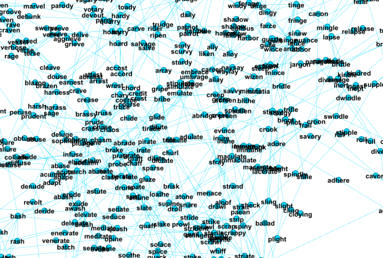

[](https://travis-ci.org/BichengLUO/K3SimSearch)
#  K3SimSearch

[English](./README.md)

K3SimSearch是用来帮助查找和搜索外形相近（**不是释义相近**）的GRE单词的一段简单Python脚本。它可以作为GRE备考小工具，帮助你更好地记忆单词。

<a href="https://asciinema.org/a/36899" target="_blank"></a>

**示例**

在`K3SimSearch.py`所在目录下的控制台输入`python K3SimSearch.py`来运行这段脚本。耐心等待数秒，编辑距离缓存加载完毕以后，你将看到如下控制台提示：

```
[Info] ZYNM3K.csv dictionary loaded!
[Info] HBS.csv dictionary loaded!
[Info] Start merging words...
[Info] Two dictionaries merged!
[Info] Start reading matrix from local cache...
[Info] Reading matrix data done!
[Info] Matrix established!
Enter the word to search ("quit" to exit):
```

你可以查询任意一个单词，例如`feckless`：

```
Enter the word: feckless
============= Visually Similar ===============

feckless,  reckless

Press Enter to show definitions...
```
显示了这个以后，你可以花几秒钟回忆一下这些视觉上相似的单词的意思分别是什么，然后按回车来显示他们的释义。如下面所示：
```
Press Enter to show definitions...
=============== Definitions ==================
[0] feckless
无成果的，没有价值的：having no worth；粗心不负责任的：careless
-----------------------------------
[1] reckless
不考虑后果的，大胆鲁莽的：careless
-----------------------------------
```
如果你查询单词时候，出现了细微的拼写错误，我们的脚本将会返回给你最相近的词条解释。例如，我们输入`caramity`:

```
Enter the word: caramity
[Error] We can't find caramity in the dictionary
[Info] Are you looking for calamity?
============= Visually Similar ===============

calamity,  clarity

Press Enter to show definitions...
```
脚本在搜索不到`caramity`这个单词的同时，会返回一个最接近的单词`calamity`，并以这个单词作为你要查询的单词进行相似性搜索。

K3GraphGen
------------
`K3GraphGen.py`是一段根据GRE单词之间的视觉的相近性来生成图格式（[GEXF](https://gephi.org/gexf/format/)）的Python脚本。需要安装[Gephi](https://gephi.org/) 来打开GEXF格式的文件。这个Gephi是一款开源的图可视化工具，它提供了很多与图相关的操作功能。

将GEXF文件导入到Gephi当中以后，我们可以以不同的布局方式对这个图进行可视化预览。而且，为了方便更加简洁明了地浏览这个图，我们也提供了一个`k3.gephi`项目文件来帮助用户进行预览。


